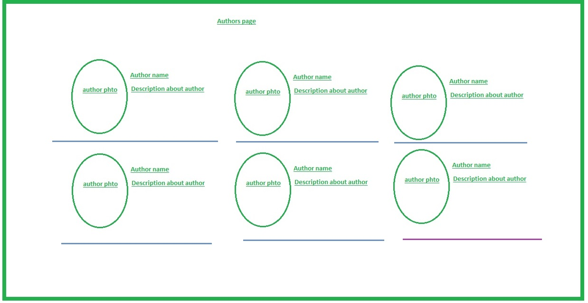

# WT-Lab
Web Technologies Lab

## Lab Program 5:

Develop static pages (using Only HTML) of an online book store. The pages should resemble: www.amazon.com. The website should consist the following pages.

a) Home page

b) Registration and user Login

c) User Profile Page

d) Books catalog

e) Shopping Cart / New Arrival Page

f) Payment By credit card

g) Order Conformation / Award Winner Page

For order conformation: Refer Customer service page -> which links to Order page

h) Best seller and Author Page

